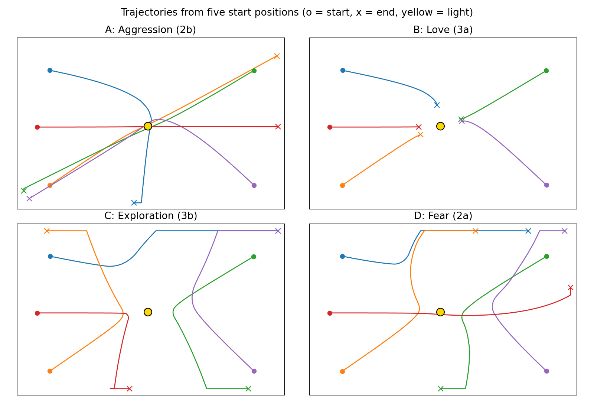

# Braitenberg Vehicles

A browser simulator of Braitenberg vehicles: simple robots with two light sensors wired directly to two wheel motors. Four classic wirings are included:

| Option | Vehicle | Wiring | Connection |
|---|---|---|---|
| A | Aggression (2b) | crossed | excitatory |
| B | Love (3a) | uncrossed | inhibitory |
| C | Exploration (3b) | crossed | inhibitory |
| D | Fear (2a) | uncrossed | excitatory |

## Running it

Open `BraitenbergABCD.html` in a browser. Drag the vehicle and the light around, pick A–D from the drop-down, and press **Load**. The sensors can be dragged in the small panel at the bottom left.

## Write-up

[`writeup/braitenberg-writeup.pdf`](writeup/braitenberg-writeup.pdf) covers how the vehicles are wired, how sensor placement changes steering, and how the inhibitory vehicles' parameters were chosen.

## License

The simulator is based on code by Harmen de Weerd and others, released under the GNU GPL v3 or later; see the headers in each source file.
